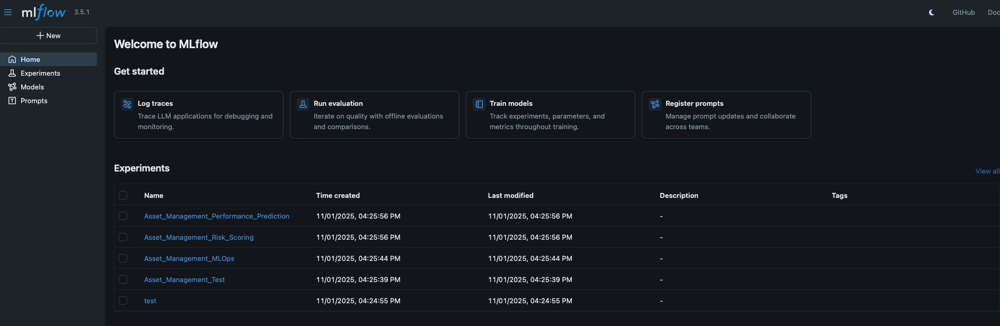
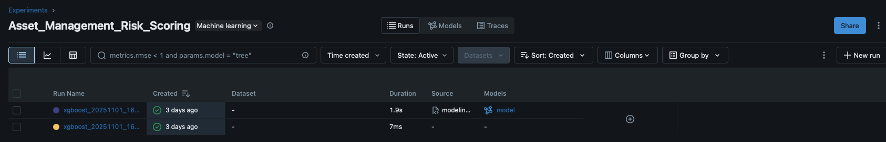
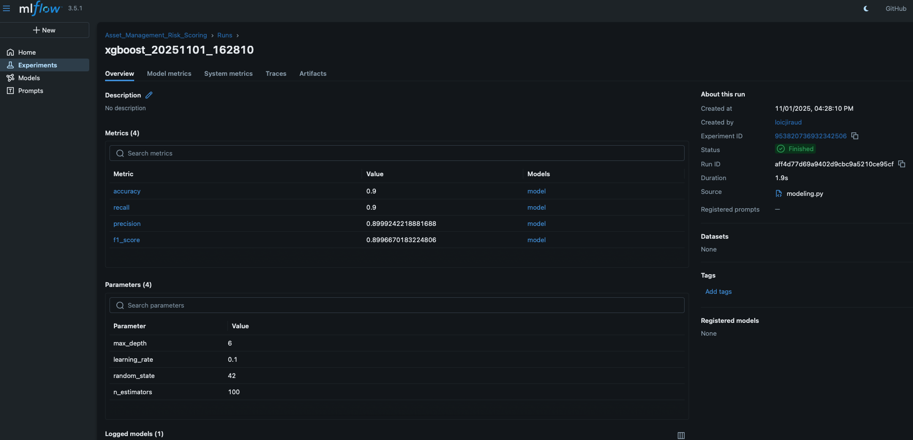
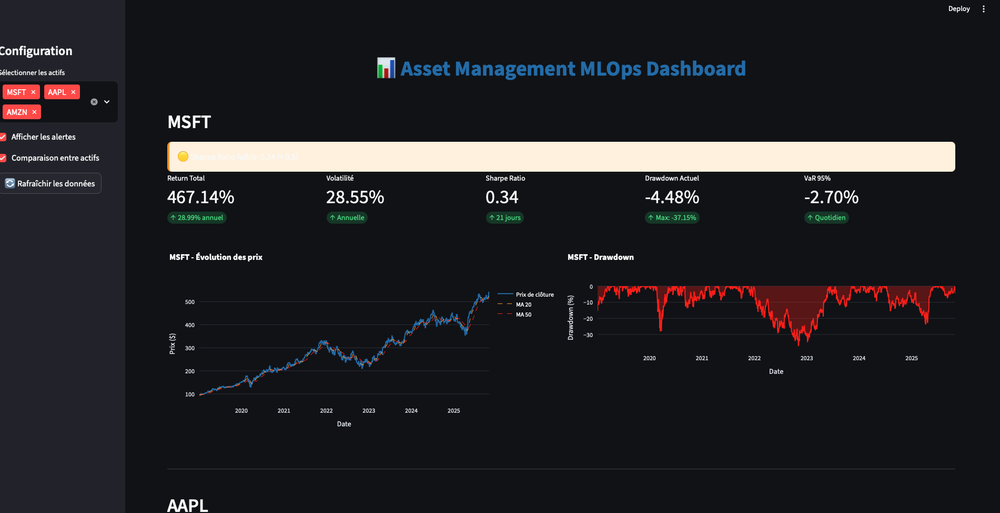
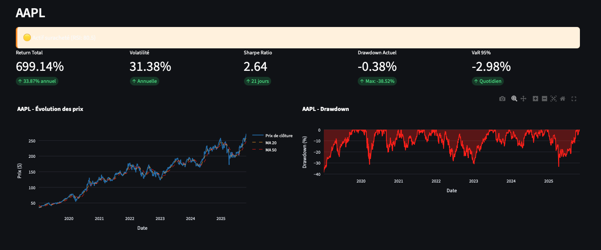
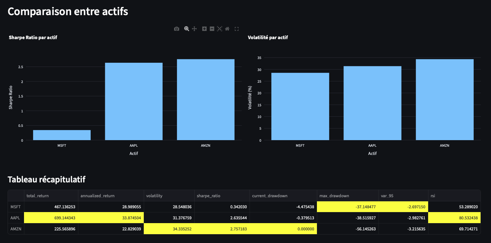

# 📸 Screenshots – Asset Management MLOps Pipeline

This folder contains key visual screenshots of the MLOps pipeline, its business outputs, and MLOps governance for reproducibility. Use these visual elements in documentation, your README, slides, or when presenting your project.

---

## MLflow Experiment Tracking

### [mlflow-homepage.png](mlflow-homepage.png)

*MLflow main registry overview: lists all experiment groups (performance prediction, risk scoring, MLOps tests). Demonstrates organization and tracking of the full project’s experimentation history. Perfect to show the workflow “industrial” side.*

---

### [mlflow-risk_summary.png](mlflow-risk_summary.png)

*Experiment comparison view for “Asset Management Risk Scoring”: enables transparent model comparison (XGBoost, Random Forest, Logistic Regression) and versioning. Useful for explaining model selection/optimization logic.*

---

### [mlflow-run_detail.png](mlflow-run_detail.png)

*Detailed run of an XGBoost model (risk scoring). All hyperparameters (max_depth=6, learning_rate=0.1...), metrics (accuracy, recall, precision, f1_score ≈ 0.9) and audit info (user, code source, timestamp, duration) are tracked. This screenshot proves end-to-end traceability and compliance readiness.*

---

## Streamlit Interactive Dashboard – Business Intelligence

### [dashboard-main.png](dashboard-main.png)

*Main dashboard landing page: select multiple assets, see global portfolio KPIs, visualize risk/performance alerts, compare assets interactively. Designed for asset managers’ daily monitoring.*

---

### [dashboard-aapl.png](dashboard-aapl.png)

*Single asset analysis (AAPL): shows return, annual volatility, Sharpe Ratio, Value at Risk, drawdown detection. Technical indicator signals (RSI > 80: “overbought”) appear as contextual alerts. Graphs provide long-term price history and historic drawdown mappings.*

---

### [dashboard-comparison.png](dashboard-comparison.png)

*Cross-asset comparison: bar charts for Sharpe Ratio and volatility by asset, summary table of returns, drawdown, and all business KPIs per asset. Delivers portfolio-level insights for risk/return optimization.*

---

## How to cite/use these in your documentation :

1. Copy/paste the Markdown image tag wherever you want to insert the corresponding visual.
   - Example:  
     ```
     
     ```
2. Use the descriptions above for README/slide/soutenance captions.
3. Reference this file at the top of your main README:
   - `[See all demo screenshots and explanations here.](./screenshots/README.md)`

---

**Tip:** For a recruiter/jury/manager, this gallery gives an instant visual overview of your MLOps workflow, model governance, and real-world dashboard for finance.
